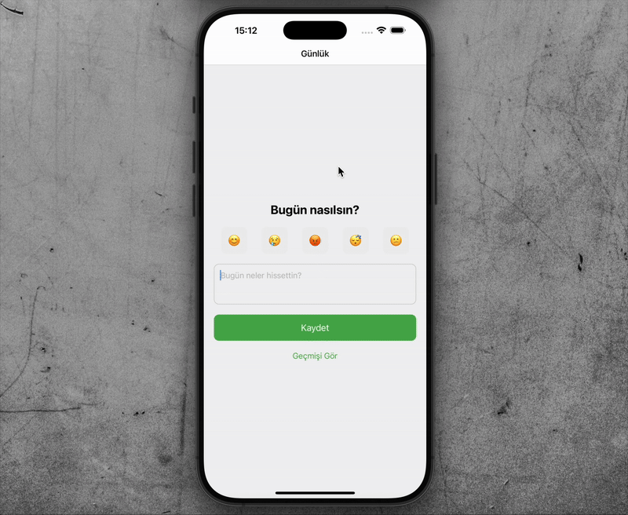

# 📘 Diary – Ruh Hali Günlüğü Uygulaması

Diary, kullanıcıların günlük olarak ruh halini ve hislerini kaydedebileceği, geçmiş kayıtlarını görebileceği basit ve işlevsel bir pratik React Native uygulamasıdır.

---

## ✨ Özellikler

- 😊 Emoji ile ruh hali seçimi
- 📝 Günlük not yazma
- 💾 Kayıtları kalıcı olarak saklama
- 📆 Geçmiş kayıtları listeleme
- 🗑️ Kayıt silme (eklendi)
- ✅ TypeScript ile güvenli veri yapıları
- 🚀 Expo ile hızlı geliştirme ortamı

---

## Kullanılan Teknolojiler

- React Native
- Expo
- TypeScript
- AsyncStorage
- React Navigation

---

## Ekran Görüntüsü

